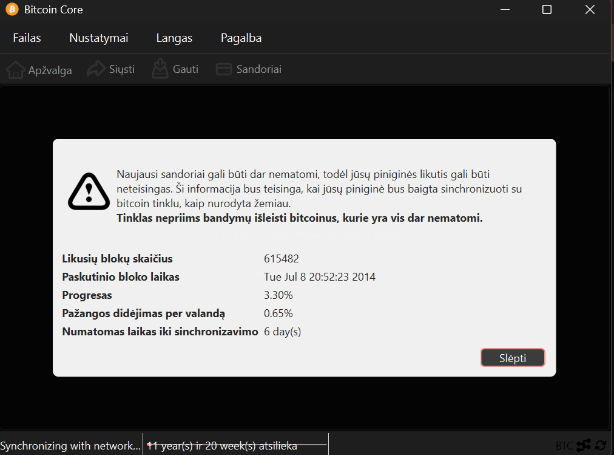

# 3-oji (papildoma) užduotis: Bitcoin transakcijų ir blokų" analizė su Libbitcoin ir python-bitcoinlib 

## 1 užduotis

## Merkle medžio implementacija su Libbitcoin 


## 2 užduotis

## Pilno Bitcoin mazgo (Bitcoin Core) įdiegimas 

Kadangi aš neturiu pakankamai vietos savo kompiuteryje, siunčiausi 140GB kiekio Bitcoin Core mazgo. 

Operacinė sistema - Windows.

1. Atsisiųsti iš [čia](https://github.com/bitcoin/bitcoin) naujausiame releas'e siūlomame link'e versija bitcoin-28.3-win64.zip   

2. Atidaryti zip savo kompiuteryje.

3. Paleisti bitcoin-qt.exe randamą "C:\bitcoin-30.0\bin\bitcoin-qt.exe".


Kursiokai žinantys mano informaciją gali padaryti taip:

bitcoin-cli -rpcconnect=... -rpcuser=... -rpcpassword=... getblockchaininfo

Ten, kur ..., reikia įrašyti duotą informaciją




## 3 užduotis

## Bitcoin tinklo analizė su python-bitcoinlib

Naudojau VU Bitcoin mazgą. 

# Kaip python-bitcoinlib naudojama bendrauti su Bitcoin mazgu?

python-bitcoinlib biblioteka naudoja RPC (Remote Procedure Call) protokolą bendrauti su Bitcoin Core mazgu.

Štai kaip tai veikia:

1. Ryšio užmezgimas: RawProxy() sukuria ryšį su lokaliu Bitcoin Core mazgu, kuris turi būti paleistas ir sukonfigūruotas leisti RPC užklausas.

2. Konfigūracija: Bitcoin Core mazge reikia nustatyti bitcoin.conf faile:

- rpcuser ir rpcpassword (autentifikacijai)
- rpcport (paprastai 8332 mainnet)
- server=1 (įjungti RPC serverį)

3. RPC metodai: Per RawProxy() objektą galite kviesti Bitcoin Core RPC metodus:

- getblockchaininfo() - gauna bendrą blockchain informaciją
- getrawtransaction(txid) - gauna transakcijos duomenis
- decoderawtransaction(raw_tx) - dekoduoja hex formatą į JSON
- getblock(blockhash) - gauna bloko informaciją
- getblockhash(height) - gauna bloko hash pagal aukštį

python-bitcoinlib/putty.txt išsaugotas visas pokalbis

python-bitcoinlib įdėti visi naudoti failai

# Parašykite programą, kuri apskaičiuoja Bitcoin transakcijos mokestį pagal jos hash'ą.

Išbandykite ją su šia 2019-09-06 įvykusia viena vertingiausių transakcijų

btc_fee_calculator.py


```
user35@aleksandr-OptiPlex-790:~/bitcoin_task3$ python3 btc_fee_calculator.py
Bitcoin transakcijos mokesčio analizė
==================================================
Gaunama transakcija: 4410c8d14ff9f87ceeed1d65cb58e7c7b2422b2d7529afc675208ce2ce0                                                                             9ed7d

=== OUTPUTS ===
  Output 0: 94504.03465148 BTC

Bendra output'ų suma: 94504.03465148 BTC

=== INPUTS ===
  Input iš 8cace7bd82a5e01a...:127 = 0.00000666 BTC
  Input iš ae760f937e8e8462...:0 = 0.00000666 BTC
  Input iš d06985a9c1ba26e1...:1 = 0.00500000 BTC
  Input iš 0b66343034e84915...:1 = 0.00000674 BTC
  Input iš 786cf1ab0510eea3...:55 = 0.00000777 BTC
  Input iš 786cf1ab0510eea3...:67 = 0.00000777 BTC
  Input iš 786cf1ab0510eea3...:77 = 0.00000777 BTC
  Input iš d54a4e029dcd2cd4...:0 = 99.69950753 BTC
  Input iš c621bebf4364c221...:0 = 0.00006660 BTC
  Input iš a189a98bc153c6cd...:0 = 0.00000826 BTC
  Input iš 00c8b0a2c3c99a83...:0 = 0.00001000 BTC
  Input iš e7a472b04046987e...:0 = 0.00000666 BTC
  Input iš f72ec3163fae2195...:1 = 237.99896214 BTC
  Input iš fda3afaab7339807...:1 = 0.00000546 BTC
  Input iš 9ac19bf20cc2811e...:0 = 0.00010000 BTC
  Input iš 456f34382ccf636b...:1 = 0.00026425 BTC
  Input iš 6ab4e1d53715ad4d...:1641 = 0.00000888 BTC
  Input iš 77d068a8718515b4...:0 = 0.00016900 BTC
  Input iš 88bb6712b0765ab9...:0 = 0.00027282 BTC
  Input iš 39d80c40a9f5535a...:0 = 0.00001000 BTC
  Input iš 6872ea948f11296c...:5 = 0.00001000 BTC
  Input iš c358e5004eb4ddf6...:1 = 0.00000555 BTC
  Input iš fd502081d0107876...:13 = 0.00001000 BTC
  Input iš fd502081d0107876...:74 = 0.00001000 BTC
  Input iš fd502081d0107876...:88 = 0.00001000 BTC
  Input iš e291e64abea0d02f...:14 = 0.00050505 BTC
  Input iš 5afc2e8b32f212f5...:0 = 0.00008492 BTC
  Input iš ed90abab95f98247...:1 = 0.00000546 BTC
  Input iš 7a93ec65e485a0d6...:1 = 0.00000546 BTC
  Input iš e33deaa82a71fe97...:0 = 0.00000674 BTC
  Input iš 4202ed5f4d06fbde...:1 = 0.00000546 BTC
  Input iš 76e0ba01d6d4a2f5...:0 = 0.00000777 BTC
  Input iš c47bf92e119c6ec6...:1 = 0.00030000 BTC
  Input iš c0731b42134f3b1c...:0 = 0.00000666 BTC
  Input iš 9708bdb056121c1e...:0 = 0.00001000 BTC
  Input iš 373c2dac4878b6d9...:0 = 0.00009110 BTC
  Input iš 72e2adb607208aa0...:0 = 0.00000780 BTC
  Input iš 489c35cb0d8605e4...:0 = 0.00000666 BTC
  Input iš e7210cb4765e3059...:1 = 0.00000888 BTC
  Input iš a125f75d276d3cc9...:0 = 1103.99895996 BTC
  Input iš d2fc5dc604d7b806...:63 = 0.00000888 BTC
  Input iš 10dccfdf2de534b8...:1 = 0.00006660 BTC
  Input iš 24ce79cd770e7b0a...:52 = 0.00000888 BTC
  Input iš 24ce79cd770e7b0a...:63 = 0.00000888 BTC
  Input iš 98949bc325bc9546...:1 = 0.00000667 BTC
  Input iš 4a721b9e1a241632...:1 = 12799.99950753 BTC
  Input iš 2b8a08ba1704edf1...:0 = 0.00005430 BTC
  Input iš 5dbf916c2143b2ee...:0 = 15000.00000000 BTC
  Input iš a329111f6384c359...:1 = 0.00000777 BTC
  Input iš f1f7794bba98dcec...:0 = 0.00010000 BTC
  Input iš cf9ffb71b7c4eec8...:81 = 0.00001000 BTC
  Input iš e67b46e22b1968a8...:31 = 0.00011110 BTC
  Input iš 0451edfbb2be7450...:0 = 0.00000546 BTC
  Input iš 9edcde04172351ec...:0 = 20000.00000000 BTC
  Input iš ad2b58216d977597...:19 = 0.00000666 BTC
  Input iš ad2b58216d977597...:95 = 0.00000666 BTC
  Input iš ad2b58216d977597...:105 = 0.00000666 BTC
  Input iš 1d6580dcd979951b...:90 = 0.00000888 BTC
  Input iš 172fe4c5538a89e0...:1 = 0.00003000 BTC
  Input iš f431d3763e773ad4...:0 = 0.00100000 BTC
  Input iš 1bd07989930f9df1...:582 = 0.00021130 BTC
  Input iš 91180e9b1de89b8d...:0 = 0.00000777 BTC
  Input iš d3409f7becbdb7ae...:11 = 0.00001000 BTC
  Input iš d3409f7becbdb7ae...:80 = 0.00001000 BTC
  Input iš 2381ce3a83cdd7ea...:1 = 18000.00000000 BTC
  Input iš 7c973dcff7d858b9...:1 = 14999.89950753 BTC
  Input iš e87e8ae4d29db81b...:1 = 0.00000667 BTC
  Input iš ba3adb49aca3a4dd...:0 = 0.00011700 BTC
  Input iš 763399427209efd5...:12 = 0.00003300 BTC
  Input iš 763399427209efd5...:54 = 0.00003300 BTC
  Input iš e745bf82b3b70d73...:0 = 0.00000777 BTC
  Input iš eeaa58cee71d362f...:1 = 0.00010000 BTC
  Input iš 8163009e0c5a75c4...:545 = 0.00000547 BTC
  Input iš 8163009e0c5a75c4...:682 = 0.00000547 BTC
  Input iš 74e15b7c4c4bc9f6...:0 = 0.00010000 BTC
  Input iš 4ab87efb6b70f478...:0 = 9.89950753 BTC
  Input iš a0391c611e6cc0ae...:0 = 0.00000666 BTC
  Input iš 0afccdc0e1a530f4...:1 = 0.00000546 BTC
  Input iš 139bb9a41407369c...:0 = 0.00000684 BTC
  Input iš 4d7f06923a9116aa...:0 = 0.00000567 BTC
  Input iš ac3ca69e3ce2fe3e...:721 = 0.00025140 BTC
  Input iš 6aed8207fa5059da...:1 = 0.00003330 BTC
  Input iš d40595412e579b95...:0 = 11799.99950753 BTC
  Input iš ed07babbc02f7424...:1 = 0.00000546 BTC
  Input iš 7d2f0d57fc5fada1...:1 = 439.69895996 BTC
  Input iš 5df0b2289f2aa481...:0 = 12.89596872 BTC
  Input iš 1bed36f2c4001d72...:0 = 0.00000777 BTC
  Input iš 7f0c966953876764...:1 = 0.00000555 BTC
  Input iš edb9d2010d1dd8d8...:0 = 0.00001000 BTC
  Input iš 7486387797f1229e...:3 = 0.00000828 BTC
  Input iš b4ad01c12e92320b...:0 = 0.00000555 BTC
  Input iš 4b0cea363df8214e...:0 = 0.00010197 BTC

Bendra input'ų suma: 94504.10000000 BTC

==================================================
TRANSAKCIJOS MOKESTIS: 0.06534852 BTC
Transakcijos dydis: 13611 vbytes
Mokestis už bytą: 480.12 satoshi/vbyte
==================================================

Mokestis USD (2019-09-06 kursu): $686.16
Mokestis satoshi: 6,534,852 sat

```

# Patikrinkite bloko hash'ą: Parašykite programą, kuri patikrina, ar bloko hash'as yra teisingai apskaičiuotas pagal bloko header'io informaciją.

btc_block_validator.py


```
user35@aleksandr-OptiPlex-790:~/bitcoin_task3$ python3 btc_block_validator.py
Bitcoin bloko hash'o validatorius
======================================================================

======================================================================
Testuojamas blokas: 0
======================================================================
Bloko #0 hash: 000000000019d6689c085ae165831e934ff763ae46a2a6c172b3f1b60a8ce26f

======================================================================
BLOKO HEADER INFORMACIJA:
======================================================================
Versija:           1 (0x00000001)
Ankstesnis blokas: 0000000000000000000000000000000000000000000000000000000000000000
Merkle Root:       4a5e1e4baab89f3a32518a88c31bc87f618f76673e2cc77ab2127b7afdeda33b
Laikas:            1231006505 (1231006505)
Bits (Difficulty): 1d00ffff
Nonce:             2083236893

Bloko hash (tikrasis): 000000000019d6689c085ae165831e934ff763ae46a2a6c172b3f1b60a8ce26f

Suformuotas header (hex): 0100000000000000000000000000000000000000000000000000000000000000000000003ba3edfd7a7b12b27ac72c3e67768f617fc81bc3888a51323a9fb8aa4b1e5e4a29ab5f49ffff001d1dac2b7c
Header'io ilgis: 80 baitai

======================================================================
VALIDACIJOS REZULTATAS:
======================================================================
Apskaičiuotas hash: 000000000019d6689c085ae165831e934ff763ae46a2a6c172b3f1b60a8ce26f
Tikrasis hash:      000000000019d6689c085ae165831e934ff763ae46a2a6c172b3f1b60a8ce26f

✓ HASH'AS TEISINGAS! Blokas validus.

======================================================================
PAPILDOMA INFORMACIJA:
======================================================================
Leading zeros: 10
Hash (decimal): 10628944869218562084050143519444549580389464591454674019345556079
Difficulty: 1
Transakcijų skaičius: 1

```
